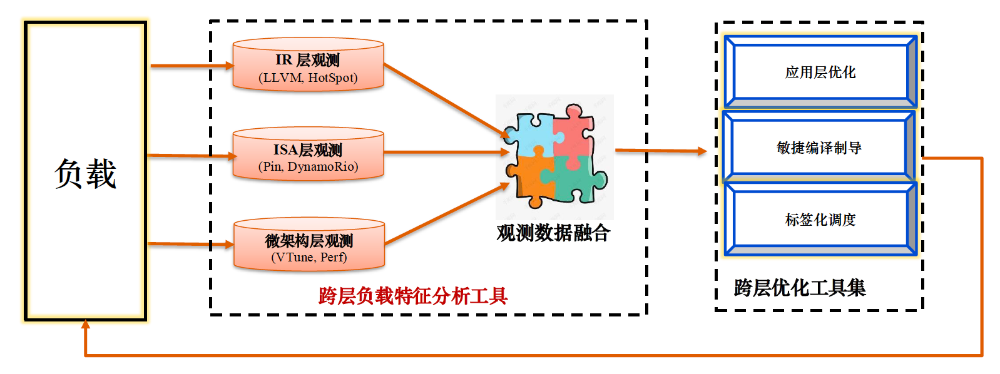

# WPC tool

# WPC (Whole-picture Workload Characterization)

## Overview
WPC (Whole-picture Workload Characterization) is an advanced analysis tool that quantifies how critical system components impact computational pipeline efficiency. The tool achieves this by comprehensive data collection and hierarchical analysis including three fundamental layers:

- Intermediate Representation (IR) Layer: Languages, programming frameworks, compilers
- Instruction Set Architecture (ISA) Layer: Runtime environments, third-party libraries, OS
- Microarchitecture Layer: Hardware execution characteristics

Cross-Platform Support
Compatible with x86, ARM, and RISC-V architectures across multiple operating systems

## Using WPC
## Downloading WPC
## WPC Component Tools

WPC is built from existing tools:
- The  
- And more, including opcode counts, branch instrumentation, etc.: see [API samples](https://dynamorio.org/API_samples.html)
## Help

Use the [discussion list](http://groups.google.com/group/DynamoRIO-Users)
to ask questions.

To report a bug, use the [issue
tracker](https://github.com/DynamoRIO/dynamorio/issues).

See also [the DynamoRIO home page](http://dynamorio.org/): [http://dynamorio.org/](http://dynamorio.org/)
